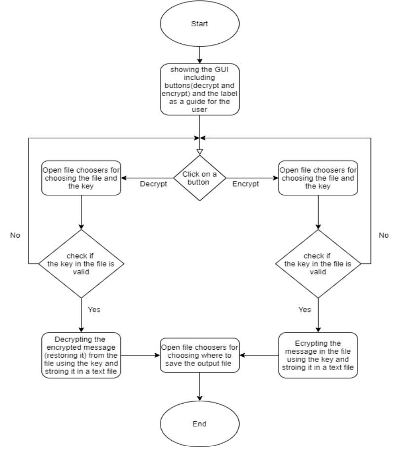

## The Main Idea

Encrypting a file text containing a message using a numerical key stored in another file text the outputting the encrypted message in a file text. The program also can restore an encrypted message from a file text using the same key used in encrypting it.

A picture containing clock, drawing, keyboard Description automatically generated

### Design
This is how the app should look like.

### UML

### Flowchart

## Usage

### 1. Encrypting

1. Choose the process you want either Encryption or Decryption by clicking on its button below.

2. You should see a file explorer pop-up window asking you to choose the message and the key files, respectively.

Note: the key file should consist of digits only, If you chose a file containing any character or special character, the app will show an error message 

3. Now the app will encrypt/decrypt the message and open a file explorer pop-up window to choose where to store the encrypted/decrypted message.
